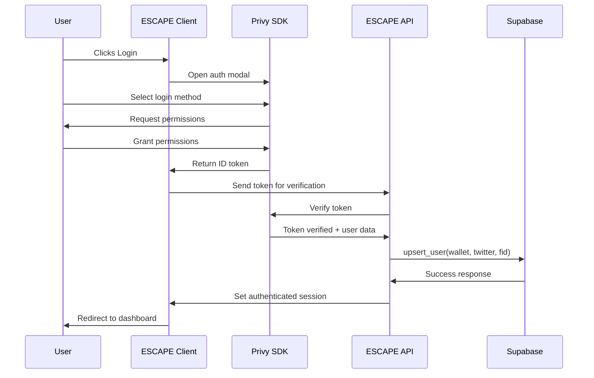

# 🧭 Project Planning Document (planning.md)

This document outlines the foundational architecture, guiding principles, and design constraints of the **ESCAPE Creator Engine** — a Web3-native creator platform for IP storytelling, NFT progression, community lore, and gamified quest ecosystems.

---

## 🎯 Purpose
ESCAPE empowers creators to:
- Build their own interactive IP worlds without writing code
- Manage gated content, quests, and NFT evolutions
- Connect directly with their Farcaster and X.com followers
- Monetize through staged NFT drops, affiliate programs, and lore-based progression

The platform is intended to operate as a hybrid between:
- **No-code publishing tools** (like Webflow or Mighty Networks)
- **Web3-native community engines** (like Zora + Farcaster + Lore)

Creators manage everything through an intuitive admin dashboard - they never need to directly access Supabase, Sanity CMS, or write any code.

### 🌊 User Journey & Monetization Flow

The ESCAPE platform follows a strategic user journey that builds community engagement before monetization:

1. **Community Onboarding**
   - Users are invited to join the Creator's community
   - Can subscribe to support the Creator (optional)
   - Can participate in the affiliate program to earn from referrals

2. **Free NFT & Gamified Engagement**
   - Users receive FREE initial NFTs as entry point
   - Engage with Creator's IP through interactive content
   - Collect Grails and unlock progressive stages
   - Evolve their NFT as proof of loyalty and engagement
   - Earn XP through active participation

3. **Premium NFT Access**
   - After proving engagement through evolved free NFTs
   - Users with highest evolved NFTs and most XP gain:
     - Priority access to premium/paid NFT mints
     - Opportunity to mint NFTs with highest rarity
     - Special whitelist privileges for future drops

This progression rewards the most loyal community members while creating a sustainable monetization path for Creators.

---

## 🧱 Core Tech Stack

| Layer        | Tooling                            |
|--------------|-------------------------------------|
| Frontend     | React + Tailwind CSS + Shadcn UI    |
| State / Auth | Privy (Wallet + X + Farcaster)      |
| Database     | Supabase                            |
| CMS          | Sanity (creator-managed content UI) |
| Blockchain   | BASE (ERC-721 NFT support)          |

*Note: Supabase Model Context Protocol (MCP) should be used when implementing the database schema*

Optional:
- Alchemy (NFT event listeners / contract triggers)
- Dune (on-chain analytics dashboards)

---

## 🔧 ESCAPE Model Context Protocol (MCP)

The project aims to create a suite of MCP servers that can be used individually or together to enhance LLM capabilities.

### Architecture

#### Core Principles

1. **Modularity**: Each MCP server is a standalone module that can be used independently.
2. **Extensibility**: Servers are designed to be easily extended with new tools and capabilities.
3. **Standardization**: All servers follow the MCP specification and use consistent patterns.
4. **Security**: Servers implement proper authentication and authorization mechanisms.
5. **Secrets Management**: No API tokens or secrets are hardcoded. All sensitive information is stored securely and accessed at runtime.

#### Directory Structure

```
ESCAPE/
├── servers/                  # Directory containing all MCP servers
│   ├── supabase/             # Supabase MCP server
│   │   ├── __init__.py
│   │   ├── server.py         # Main server implementation
│   │   ├── client.py         # Supabase client implementation
│   │   └── tests/            # Tests for the Supabase server
│   ├── git/                  # Git MCP server
│   │   ├── __init__.py
│   │   ├── server.py         # Main server implementation
│   │   ├── commands.py       # Git command implementations
│   │   └── tests/            # Tests for the Git server
│   ├── sanity/               # Sanity CMS MCP server
│   │   ├── __init__.py
│   │   ├── server.py         # Main server implementation
│   │   ├── client.py         # Sanity client implementation
│   │   └── tests/            # Tests for the Sanity server
│   ├── context7/             # Context7 MCP server
│   │   ├── __init__.py
│   │   ├── server.py         # Main server implementation
│   │   ├── client.py         # Context7 client implementation
│   │   └── tests/            # Tests for the Context7 server
│   ├── figma/                # Figma MCP server
│   │   ├── __init__.py
│   │   ├── server.py         # Main server implementation
│   │   ├── client.py         # Figma client implementation
│   │   └── tests/            # Tests for the Figma server
│   └── ...                   # Other servers
├── core/                     # Shared core functionality
│   ├── __init__.py
│   ├── utils.py              # Utility functions
│   ├── secrets.py            # Secrets management utilities
│   └── testing.py            # Testing utilities
├── admin/                    # Admin dashboard
│   ├── __init__.py
│   ├── routes/               # API routes
│   │   ├── __init__.py
│   │   ├── auth.py           # Authentication routes
│   │   └── secrets.py        # Secrets management routes
│   └── components/           # UI components
│       ├── __init__.py
│       ├── SecretsManager.jsx # Secrets management UI
│       └── ...               # Other components
├── examples/                 # Example usage of the servers
├── docs/                     # Documentation
├── tests/                    # Integration tests
├── .env.example              # Example environment variables
├── requirements.txt          # Project dependencies
├── setup.py                  # Package setup
└── README.md                 # Project documentation
```

### Coding Style and Conventions

#### Python Style

- Follow PEP 8 style guidelines
- Use type hints for all function parameters and return values
- Use docstrings for all modules, classes, and functions
- Use async/await for asynchronous code

#### Naming Conventions

- **Files**: Use snake_case for file names (e.g., `supabase_client.py`)
- **Classes**: Use PascalCase for class names (e.g., `SupabaseClient`)
- **Functions/Methods**: Use snake_case for function and method names (e.g., `get_table_rows`)
- **Variables**: Use snake_case for variable names (e.g., `table_name`)
- **Constants**: Use UPPER_SNAKE_CASE for constants (e.g., `DEFAULT_TIMEOUT`)

#### MCP Tool Conventions

- Tool names should be descriptive and follow the pattern `{service}_{action}` (e.g., `git_commit`, `supabase_read`)
- Tool descriptions should be clear and concise, explaining what the tool does and how to use it
- Tool parameters should have descriptive names and include type information
- Tool return values should be consistently formatted (preferably JSON for complex data)

### Testing Strategy

- **Unit Tests**: Each server should have comprehensive unit tests for all tools and functionality
- **Integration Tests**: Tests that verify the servers work correctly with the MCP protocol
- **End-to-End Tests**: Tests that verify the servers work correctly with actual LLMs
- **Test Coverage**: Aim for at least 80% test coverage for all code

### Global Rules

1. **Error Handling**: All tools should handle errors gracefully and provide meaningful error messages
2. **Logging**: Use the MCP Context for logging information, warnings, and errors
3. **Documentation**: All code should be well-documented with docstrings and comments
4. **Security**: Never expose sensitive information in logs or error messages
5. **Versioning**: Follow semantic versioning for all releases
6. **Dependencies**: Minimize external dependencies and document them clearly
7. **Configuration**: Use environment variables for configuration where appropriate
8. **Backward Compatibility**: Maintain backward compatibility when updating existing tools
9. **Secrets Management**: Never hardcode API tokens or secrets. Always retrieve them from the secure secrets manager at runtime
10. **Access Control**: Implement proper role-based access control (RBAC) for all admin functionality

### Development Workflow

1. **Task Definition**: Define the task in TASK.md with clear requirements and acceptance criteria
2. **Implementation**: Implement the task following the architecture and coding style guidelines
3. **Testing**: Write tests for the implementation and ensure all tests pass
4. **Documentation**: Update documentation to reflect the changes
5. **Review**: Review the implementation to ensure it meets the requirements and follows the guidelines
6. **Merge**: Merge the changes into the main branch
7. **Mark as Complete**: Mark the task as complete in TASK.md

### Next Steps and Roadmap

#### Phase 1: Core Infrastructure

- Set up project structure and core utilities
- Implement Supabase MCP server
- Implement Git MCP server
- Create comprehensive tests for both servers

#### Phase 2: Additional Servers

- Implement additional MCP servers for other services
  - Context7 MCP server for up-to-date documentation for LLMs and AI code editors
  - Privy MCP server for authentication
  - BASE MCP server for blockchain integration
  - Figma MCP server for design system integration
- Create integration examples
- Improve documentation

#### Phase 3: Admin Dashboard and Secrets Management

- Implement a secure admin dashboard for managing the platform
- Create a secrets management system for storing API tokens and other sensitive information
- Implement role-based access control (RBAC) for admin functionality
- Integrate Supabase Vault for secure storage of secrets

### Phase 4: Advanced Features

- Implement advanced features for existing servers
- Create a unified server that combines multiple servers
- Develop a CLI for managing servers

---

## 🧑‍🚀 Primary User Types

| Role         | Permissions & View Scope                            |
|--------------|------------------------------------------------------|
| Creator      | Full dashboard, analytics, content editor, minting  |
| Community Member | View comic reader, quests, lore submission, NFT panel |
| Guest        | Public content only (landing, intro comics)         |

---

## 🔐 Authentication Strategy
- Auth managed via **Privy**
  - Wallet connect (self-custodial)
  - X.com (Twitter)
  - Farcaster (FID linking, profile sync)

All identities mapped to a unified `users` record in Supabase.

### 🔐 Privy Integration
*Detailed implementation for the authentication strategy*

#### Installation & Setup
```bash
# Install Privy SDK packages
npm i @privy-io/react-auth @privy-io/server-auth
```

#### Environment Configuration
```env
# Server-side authentication
PRIVY_APP_ID=<your_privy_app_id>
PRIVY_APP_SECRET=<your_privy_secret>

# Client-side configuration
NEXT_PUBLIC_PRIVY_APP_ID=<your_privy_app_id>
```

#### Client Implementation
```typescript
// frontend/src/providers/auth-provider.tsx
import { PrivyProvider } from '@privy-io/react-auth';

export function AuthProvider({ children }) {
  return (
    <PrivyProvider
      appId={process.env.NEXT_PUBLIC_PRIVY_APP_ID}
      config={{
        loginMethods: ['wallet', 'twitter', 'farcaster'],
        appearance: {
          theme: 'light',
          accentColor: 'var(--color-primary)'
        },
        embeddedWallets: {
          createOnLogin: 'users-without-wallets'
        }
      }}
      onSuccess={(user) => {
        // Sync with Supabase
        supabaseSync(user);
      }}
    >
      {children}
    </PrivyProvider>
  );
}
```

#### Server Verification
```typescript
// backend/auth/verify.ts
import { PrivyClient } from '@privy-io/server-auth';

const privyClient = new PrivyClient(
  process.env.PRIVY_APP_ID,
  process.env.PRIVY_APP_SECRET
);

export async function verifyPrivyToken(token: string) {
  try {
    const verifiedUser = await privyClient.verifyAuthToken(token);
    return verifiedUser;
  } catch (error) {
    console.error('Privy token verification failed:', error);
    return null;
  }
}
```

#### Supabase Synchronization
```typescript
// frontend/src/lib/auth/supabase-sync.ts
export async function supabaseSync(privyUser) {
  const { data, error } = await supabase.rpc('upsert_user', {
    wallet_address: privyUser.wallet?.address || null,
    twitter_handle: privyUser.twitter?.username || null,
    farcaster_fid: privyUser.farcaster?.fid || null,
    display_name: privyUser.name || null,
    avatar_url: privyUser.avatar || null
  });

  if (error) {
    console.error('Failed to sync user with Supabase:', error);
    return false;
  }

  return data;
}
```

#### Authentication Flows & Callbacks

| Flow | Callback URL | Description |
|------|--------------|-------------|
| Standard Login | `/auth/callback/privy` | Handle post-authentication redirect |
| Wallet Connect | `/auth/wallet/callback` | Process wallet connection |
| Social Auth | `/auth/social/callback` | Handle social login completion |

#### Error Handling & Recovery

| Error State | User Experience | System Action | Recovery |
|-------------|----------------|--------------|----------|
| `login_cancelled` | Toast: "Login cancelled" | No state change | Re-prompt on protected actions |
| `token_expired` | Toast: "Session expired" | Clear local session | Silent re-auth attempt |
| `network_error` | Banner: "Connection issues" | Retry with backoff | Offer offline mode if available |
| `account_conflict` | Dialog: "Link accounts?" | Pause auth flow | Guide through account merging |

#### Integration with MCP

The Privy authentication flow integrates with the MCP architecture through:

1. The `auth` MCP server which handles token verification
2. User identity data passed to Supabase MCP for persistence
3. Session management via the client's context providers

#### Recommended Testing Scenarios

| Test Case | Expected Outcome |
|-----------|-----------------|
| `test_wallet_only_login` | New `users` row with wallet address, social fields NULL |
| `test_wallet_plus_twitter_merge` | Existing row updated; `user.identities.length === 2` |
| `test_farcaster_permissions` | User grants read+write permissions to Farcaster scope |
| `test_jwt_tampering` | API returns 401 Unauthorized |
| `test_session_expiry` | Silent refresh token attempt before logout |

#### Authentication Sequence



### 🔒 Admin Dashboard Authentication
*Dedicated login system for platform administrators - separate from Privy*

#### Overview
The Admin Dashboard uses a completely separate authentication system from the Privy-based authentication used for regular users and creators. While regular users (community members and creators) authenticate via Privy, platform administrators access the admin dashboard through this dedicated system with enhanced security controls.

This separation ensures that admin access remains independent from the Web3/social authentication mechanisms used by the platform's end users.

#### Admin Users Schema
```
table: admin_user
- id (serial, PK)
- email (text, unique)
- password_hash (text)  # bcrypt hashed passwords
- role (text)
- name (text)
- last_login (timestampz)
- created_at (timestampz)
```

#### Admin Sessions Schema
```
table: admin_sessions
- id (serial, PK)
- session_id (uuid, unique)
- admin_id (integer, FK → admin_user.id)
- created_at (timestamptz)
- expires_at (timestamptz)
- ip_address (text)
- user_agent (text)
```

#### Implementation Details

1. **Password Security**
   - Passwords are hashed using bcrypt with appropriate cost factor
   - Hashes are never exposed to the frontend
   - Password complexity requirements enforced on signup/change

2. **Authentication Process**
   ```javascript
   // Login flow
   1. Admin submits email and password
   2. Server retrieves admin by email from Supabase
   3. Server compares password against stored hash using bcrypt
   4. On success, generate unique session ID and store in admin_sessions
   5. Create JWT with admin ID, email, role, and session ID
   6. Set httpOnly secure cookie with JWT
   7. Return success response with minimal admin details
   ```

3. **Session Management**
   - Sessions tracked in database for immediate revocation capability
   - Sessions include device info (IP, user agent) for audit purposes
   - Sessions expire after configurable time period (default: 2 hours)

4. **Route Protection**
   - Protected routes use middleware to verify JWT
   - Middleware also checks that session exists and is valid in database
   - Role-based access ensures admins only access authorized routes

5. **Security Measures**
   - Rate limiting on login attempts (5 per 15-minute window)
   - CSRF protection on all admin routes
   - Consistent timing for failed logins to prevent timing attacks
   - Secure, httpOnly, SameSite=strict cookies to prevent XSS

#### Logout & Session Management
```javascript
// Logout flow
1. Retrieve token from cookie and verify
2. Delete session from admin_sessions table
3. Clear the admin_token cookie
4. Return success response
```

#### Integration with MCP
The admin authentication system integrates with the project's MCP architecture:
- Uses Supabase MCP server for data storage and retrieval
- Admin session data is never exposed through public APIs
- Secrets (JWT signing keys) managed through the secrets management system

---

## 🧩 Platform Modules

1. **Dashboard (Creator Panel)**
   - NFT mint tool
   - Stage configurator (1–13 stage support)
   - Quest + Grail manager
   - Whitelist logic builder
   - Analytics and user activity views (detailed metrics and insights)
   - All creator operations happen through this no-code admin interface

2. **Comic Reader + Lore Engine**
   - Pages or Panels mode (toggle)
   - Grails placed per panel with lore hooks
   - Lore submissions + canon voting window
   - Hall of Memories for top community stories

3. **Social Feed**
   - Private Farcaster-style feed per creator community
   - Cast manually or auto from events (page, mint, quest)
   - "Share to X" supported on all user actions

4. **Quests + Gamification**
   - Daily, Project, Lore, and Proof quests
   - XP, level progression, unlockable stages
   - Quest completions linked to NFT evolution paths

5. **NFT Evolution Engine**
   - ERC-721 with metadata for stages 1–13
   - Evolution tied to creator-configured conditions
   - Password gate, quest proofs, and grail clues as triggers
   - NFT evolution unlocks new content and whitelist status
   - Detailed implementation expanded in NFT Evolution Logic section below

6. **Affiliate System**
   - Commission on subscription and NFT sales
   - Ref codes linked to social login and tracked in Supabase

7. **Theming & Onboarding**
   - Creator selects 4 theme colors (60/30/10 + error) using color token system
   - Interactive color palette shuffler for quick theme exploration
   - Tailwind theme tokens auto-generated per creator
   - Dashboard grid is bento-based and fully responsive
   - Implements accessibility standards for all interfaces

8. **Analytics & Insights Platform**
   - Comprehensive community metrics and engagement data
   - Visual dashboards with actionable insights
   - User-level and aggregate performance tracking
   - Sentiment analysis and geographic distribution
   - Complete details in Analytics Overview section below

9. **Progress Tracking System**
   - Dynamic user journey visualization
   - Personalized next steps and guidance
   - Creator-configured hints and milestones
   - Real-time progression feedback
   - Detailed implementation in Progress Tracking section below

## 🔌 Service Integration & Boundaries

### Core Service Responsibilities

| Service | Primary Responsibility | Integration Points |
|---------|------------------------|-------------------|
| **Supabase** | User data, progress tracking, quests, affiliate data | Connected to frontend and Privy |
| **Sanity CMS** | Content hosting (images, dialogue, comics, grails) | Connected to frontend only |
| **Privy** | Authentication and identity management | Connected to Supabase and frontend |
| **BASE** | NFT contract deployment and evolution | Connected to frontend |

### Key Technical Boundaries

1. **Sanity CMS** is exclusively responsible for:
   - Storing and serving content assets (images, comics, etc.)
   - Managing content structure (pages, panels, dialogues)
   - Content versioning and scheduling
   - Sanity does NOT interact directly with Supabase or Privy

2. **Supabase** is exclusively responsible for:
   - Storing user data, progress, and quest completion
   - Tracking NFT evolution stages
   - Managing lore submissions and voting
   - Recording affiliate transactions
   - Serving analytics data

3. **Privy** is exclusively responsible for:
   - Identity verification (wallet, X.com, Farcaster)
   - Creating unified user accounts
   - Session management
   - Authentication data is synced to Supabase for persistence

### Authentication Flow

1. User attempts to access gated content or feature
2. Privy authentication modal displays with options:
   - Connect wallet (self-custodial)
   - X.com sign-in
   - Farcaster sign-in
3. Upon successful authentication:
   - Privy creates/verifies identity
   - User information is saved/updated in Supabase `users` table
   - All identities are mapped to a unified user record
4. User session maintained via Privy's client-side SDK
5. Permissions and access determined by user record in Supabase

## 📊 Core System Relationships

### Grails, NFT Stages, and Lore Connection

**Grails** are discoverable treasures that Creators place throughout their IP content:
- Function as hidden collectibles within comic panels/pages
- Serve as proof that users are actively engaging with the content
- When discovered, enable users to submit lore interpretations
- Community votes on submitted lore to determine which becomes "canon"
- Winning submissions enter the "Hall of Memories" (or Creator's chosen name)
- Collecting Grails provides passwords needed to unlock successive stages
- Grail count directly affects NFT evolution eligibility

**Stages** are progression levels within a Creator's project:
- Each stage has its own identity (e.g., "Stage 1: The Catacombs")
- Each stage is visualized in the dashboard as a card with its own imagery
- Stage 1 allows users to mint their initial NFT
- Advancing to new stages requires meeting specific criteria (Grails found, passwords collected)
- Reaching certain stages may unlock whitelist access to future drops

**NFT Evolution** is the visual representation of user progression:
- NFTs evolve as users advance through stages
- NFT imagery can be completely different from stage card visuals
- Evolution requires meeting Creator-defined conditions
- Conditions typically include collecting specific Grails, completing quests, and using passwords
- Each evolution updates the NFT's metadata and visual appearance
- Advanced stages may provide special access or privileges
- Highly evolved NFTs represent user loyalty and engagement
- Users with the most evolved NFTs gain priority access to premium NFT mints

This interconnected system creates a gamified experience where the NFT visually represents the user's journey through the Creator's world, with Grails serving as both discovery mechanisms and lore-building opportunities.

---

## 📦 File & Docs Architecture

| File                  | Purpose                                |
|-----------------------|----------------------------------------|
| `docs/planning.md`    | This file: vision, constraints, stack  |
| `docs/readme.md`      | App-level usage, features, instructions|
| `docs/task.md`        | Current work in progress, backlog      |
| `docs/nft-evolution.md` | NFT stage mechanics, unlocks          |
| `docs/analytics.md`   | Sentiment, location, user snapshots    |
| `docs/ui-accessibility.md` | Tailwind + ARIA + mobile standards |
| `docs/supabase-schema.md` | Tables: users, grails, quests, etc. |
| `docs/sanity-schema.md` | Pages, Panels, Lore, Grail logic     |
| `docs/social-integration.md` | X + Farcaster casting + identity |

---

## 🧬 NFT Evolution Logic
*Expanded details for the NFT Evolution Engine module*

This document explains how NFT metadata evolves through stages in the ESCAPE Creator Engine, including how creators configure evolution paths, and how users unlock new stages and whitelist eligibility.

### 🎯 Overview
Each NFT can evolve through **up to 13 stages**, with each stage:
* Visually updated (e.g. image, trait, name)
* Linked to clues, quests, and Grails
* Optionally unlocking whitelist access or rewards

Stages represent levels within a Creator's world (e.g., "Stage 1: The Catacombs", "Stage 2: The Ascension") that users progress through by engaging with the content and collecting Grails. Stages have their own visual identity in the dashboard (separate from NFT imagery), and users progress through these stages as they interact with the Creator's IP.

### ⚙️ Creator Configuration (via Dashboard)
Creators define the structure of their NFT evolution in the **Stage Configurator**:
* Set total number of stages (up to 13)
* Define Grail or Quest requirements for each stage
* Set passwords (stored off-chain) that unlock a stage
* Upload art assets per stage (e.g. via minting tool)
* Set if and when a stage unlocks Whitelist eligibility

Example configuration:

```
{
  "max_stages": 13,
  "whitelist_stage": 5,
  "grails_required": {
    "2": 1,
    "3": 2,
    "4": 3
  },
  "quests_required": {
    "5": ["quest_alpha"],
    "6": ["quest_beta", "quest_gamma"]
  }
}
```

### 🔐 Stage Unlock Logic
To evolve their NFT, a user must meet **creator-defined conditions**, such as:
* ✅ Specific number of **Grails** found
* ✅ Completion of required **quests**
* ✅ Providing a **password/clue** discovered via lore or PDF content

Grails are central to this process - as users discover these hidden treasures within the comic panels or pages, they:
1. Submit their own lore interpretations
2. Participate in community voting to determine "canon" lore
3. Collect passwords needed to unlock the next stage
4. Reach the required Grail threshold for evolution

When all conditions are met:
1. Metadata is updated (via BASE/IPFS)
2. Supabase table `nft_progress` is updated
3. Farcaster cast is optionally triggered

### ✨ Whitelist Access
* A stage (e.g. Stage 5) may be set to unlock whitelist eligibility
* Once user reaches this stage, `whitelisted = true` is set in Supabase
* Can be used to:
   * Unlock early access mints
   * Access gated Discord or community events
   * Priority access to premium/final NFT drops
   * Opportunity to mint highest rarity NFTs

### 📦 NFT Metadata Structure
NFTs are ERC-721 tokens on BASE with evolving metadata:

```
{
  "name": "Stage 5 - Ascended Form",
  "description": "Evolved by lore and proof.",
  "image": "ipfs://...",
  "attributes": [
    { "trait_type": "Stage", "value": 5 },
    { "trait_type": "Affinity", "value": "Fire" }
  ]
}
```

### 🔁 Evolution Trigger Methods
* User clicks "Evolve" on dashboard when criteria are met
* Automated via proof-of-quest submissions
* Optional: smart contract-based listener triggers (future)

### 🎮 User Experience
* Dashboard shows locked/unlocked stages (visually)
* Hovering shows requirements
* Clicking opens password field or condition checklist
* Successful evolution triggers visual effect and update

### 🏆 Creator Admin View
* Monitor user evolution stats through an intuitive dashboard
* Manually approve/override stages (if needed) via the admin panel
* Configure unlock clues, lore documents, and evolution logic through the no-code interface
* All technical complexities (Supabase, BASE, IPFS) are handled behind the scenes

---

## 📊 Analytics Overview
*Expanded details for the Analytics & Insights Platform module*

This document outlines the data insights and metrics tracked within the ESCAPE Creator Engine — spanning user engagement, sentiment, quest behavior, lore voting, wallet intelligence, and geo-distribution.

### 🎯 Key Goals of Analytics
* Help Creators understand community behavior
* Track campaign and quest performance
* Visualize geographic and sentiment-based hype
* Detect signals for whitelist or NFT stage eligibility
* Profile user behavior, retention, and wallet trends

### 📊 Dashboard Metrics (Creator View)
Displayed in the Creator Dashboard as modular bento cards:

| Metric | Description |
|--------|-------------|
| 📈 Growth Rate | Follower count growth over time (Supabase + Farcaster API) |
| 🌎 Top Regions | Geo heatmap via Mapbox based on user IPs |
| 🧠 Sentiment Score | NLP-based analysis of lore votes & Farcaster comments |
| 🧬 NFT Evolution Stats | Stage distribution (e.g. 100 users in Stage 2) |
| 🧪 Quest Engagement | Completion % of each quest |
| 🔮 Hype Score | Weighted index: engagement + XP + casts + votes |

### 📦 Data Sources

| Source | Purpose |
|--------|---------|
| Supabase Events | Page views, quest completions, lore |
| Google Analytics | Web traffic (optional) |
| Mapbox API | Country-level distribution heatmaps |
| Custom NLP Tool | Sentiment scoring from cast content |
| Farcaster API | Cast volume, follower growth |
| Alchemy (optional) | NFT transfer events, wallet metadata |

### 🧠 Sentiment Scoring Logic
1. Pull text from lore submissions + Farcaster casts
2. Send to NLP scoring API
3. Score returned from -1 (negative) to +1 (positive)
4. Averaged and visualized in analytics card

### 🌍 Regional Analytics
* Uses anonymized IP geolocation (country-level)
* Displays heatmaps of:
   * Lore voting
   * Mint activity
   * Quests completed
* Filterable by stage, quest type, campaign

### 🧪 Quest Funnel Analysis
* Track conversion per quest category:
   * % Started
   * % Completed
   * Average XP gained
   * Most skipped proof types
* Can be displayed as stacked bar or funnel chart

### 👤 User-Level Analytics View (Creator Access Only)
ESCAPE enables creators to zoom into any individual user to view a detailed activity snapshot:

| Metric Category | Details |
|----------------|---------|
| Identity | Wallet, Farcaster handle, Twitter handle, ENS name |
| Activity Summary | Total logins, last login timestamp, session count |
| XP & Stage | Total XP, current NFT stage, whitelist eligibility |
| Grail Discovery | Number of Grails found, current active page |
| Lore Contribution | Lore submissions, upvotes, canon selections |
| Quest Engagement | Quests completed, time-to-complete averages |
| Social Influence | Follower counts (optional), top shared content |
| Engagement Frequency | How often user takes action per day/week |
| Time-on-Platform | Session length or reader time per visit |
| Referral Tree | Visualizes network of invited users |

### 🔐 Privacy & Compliance
* IP addresses not stored — only region/country
* Data anonymized when presented to creators
* Opt-out toggle available in user profile settings

---

## 🎨 UI & Accessibility Guidelines
*Expanded details for the Theming & Onboarding module*

This document provides best practices for consistent, accessible, and responsive design across the ESCAPE Creator Engine web app.

### 🧱 Component System

| Framework | Purpose |
|-----------|---------|
| Tailwind CSS | Utility-first layout and responsiveness |
| Shadcn/UI | Prebuilt components with full accessibility |
| Radix UI | Headless primitives for modals, popovers |
| Lucide Icons | Icon library (SVG-based) |
| Framer Motion | Smooth animated transitions |

### 🎯 Design System Goals
* Fast iteration using Tailwind classes
* Consistent UI layout with responsive bento grid system throughout the platform
* Theme toggles for Light and Dark Mode
* Animation-enhanced feedback (hover, press, enter/exit)
* Semantic, accessible markup by default

### 🧰 Creator Theme Configuration
* During onboarding, creators select 4 colors using the token system:
   * **Primary (60%)**, **Secondary (30%)**, **Accent (10%)** — applies to UI layout
   * **Error/Surface** — used for system messages, tooltips, and alerts
* Color themes follow the **60–30–10 rule** for balanced visuals
* Creators can **shuffle palettes** during setup to preview combinations in real-time
* Selected colors propagate across the entire bento-based interface

### 🎨 Tailwind Color Tokens
Defined in `tailwind.config.js` as CSS variables:

```
theme: {
  extend: {
    colors: {
      primary: ‘var(--color-primary)’,
      secondary: ‘var(--color-secondary)’,
      accent: ‘var(--color-accent)’,
      error: ‘var(--color-error)’,
      surface: ‘#F3F4F6’,
      background: ‘#FFFFFF’,
      dark: ‘#121212’,
    }
  }
}
```

Defined globally in CSS:

```
:root {
  --color-primary: #4F46E5;
  --color-secondary: #22D3EE;
  --color-accent: #FBBF24;
  --color-error: #EF4444;
}
```

Themes update dynamically on onboarding with custom `[data-theme]` class selectors.

### ♿ Accessibility Standards

| Feature | Description |
|---------|-------------|
| **ARIA Labels** | All interactive elements use `aria-label`, `aria-expanded`, etc. |
| **Focus Rings** | Keyboard navigation highlights focused elements (tailwind: `focus:outline-*`) |
| **Color Contrast** | All text meets WCAG 2.1 AA contrast ratios |
| **Skip Links** | “Skip to content” nav support for screen readers |
| **Motion Reduction** | Respects `prefers-reduced-motion` setting |

### 📱 Mobile Responsiveness
* Tailwind breakpoint-first design (e.g., `md:grid-cols-2`)
* **Bento grid layout system applied consistently across the entire platform:**
   * Cards gracefully wrap to the next row
   * Cards **never flatten** or stretch into unreadable layouts
   * Rounded corners, shadows, and visual padding are preserved
   * Modular content blocks maintain visual consistency
* Modal, popover, and tooltip behavior changes on mobile:
   * Popovers become slide-ups
   * Dropdowns use full-width lists

---

## 🧠 AI Behavior Rules
- **Never assume missing context. Ask questions if uncertain.**
- **Never hallucinate libraries or functions** – only use known, verified Python packages.
- **Always confirm file paths and module names** exist before referencing them in code or tests.
- **Never delete or overwrite existing code** unless explicitly instructed to or if part of a task from `TASK.md`.
- **Generate new files instead of modifying existing ones** when adding substantial new functionality.
- **Document planned changes before implementation** for review and approval.
- **Respect the “Protected Files” list** in the section below for files that should never be modified automatically.

### 🔒 AI Code Generation Safeguards
*Guidelines for preventing problematic AI code modifications*

> **IMPORTANT INSTRUCTION**: All AI assistants (including Augment Code) MUST read this entire planning document at the beginning of EACH new conversation or session. AI tools must adhere to these guidelines without exception and should reference this document regularly during development to ensure compliance.

#### Protected Files
The following files should NEVER be modified automatically by AI tools:
```
# Core system files (never modify)
core/auth/privy_client.py
core/config.py
core/db/supabase_client.py
core/secrets.py

# Stable API implementations
api/routes/auth.py
api/routes/users.py

# Frontend core components
frontend/src/providers/auth-provider.tsx
frontend/src/lib/auth/supabase-sync.ts
```

#### Code Generation Workflow
1. **Plan → Review → Generate → Validate**
   - AI proposes changes in natural language first
   - Human approves specific file changes
   - AI generates code in new or approved files only
   - Automated tests validate changes don’t break functionality

2. **Incremental Approach**
   - Generate one component/function at a time
   - Integrate and test before moving to the next component
   - Commit working code frequently

3. **Explicit File Operations**
   - Use markers like `// code-gen: create file path/to/new-file.ts`
   - Never use markers to modify existing files
   - Generate complete files rather than partial updates

#### Version Control Integration
- Commit before any significant AI-guided changes
- Use feature branches for experimental changes
- Include commit message indicating AI-assisted work

#### Implementation Guards
```python
# Example pattern for preventing accidental overrides
def update_file(file_path, new_content):
    “””Update file with new content, with safeguards.

    Args:
        file_path: Path to the file to update
        new_content: New file content

    Returns:
        bool: Success or failure
    “””
    # Check if file is protected
    PROTECTED_FILES = load_protected_files_list()
    if file_path in PROTECTED_FILES:
        logging.warning(f”Attempted modification of protected file: {file_path}”)
        return False

    # Always create backup before modifying
    create_backup(file_path)

    # Only proceed if file exists (no creating new core files)
    if not os.path.exists(file_path):
        logging.warning(f”Attempted to modify non-existent file: {file_path}”)
        return False

    with open(file_path, ‘w’) as f:
        f.write(new_content)

    return True
```

#### Recovery Procedures
In case of problematic AI-generated code:

1. **Immediate Fixes**
   - Revert to last known good commit
   - Use backups from `core/backups` directory
   - Run `scripts/recovery.py` to restore system state

2. **Root Cause Diagnosis**
   - Check `logs/ai_operations.log` for AI actions
   - Analyze which instructions led to problematic behavior
   - Update planning.md with additional safeguards

3. **Prevention Tactics**
   - Add problematic file to Protected Files list
   - Create a template for the affected component type
   - Break task into smaller, isolated changes

---

## 🗃 Supabase Database Schema
*Expanded details for the database layer*

This document outlines the core tables, fields, and relationships used by the ESCAPE Creator Engine to manage users, quests, grails, lore submissions, NFT stage tracking, proof systems, and affiliate programs.

**Implementation Note:** Supabase Model Context Protocol (MCP) must be used when implementing and managing this database schema. Creators never interact directly with the database - all operations are abstracted through the platform’s admin interfaces.

### 🧑 Users
Stores basic user data, social handles, and XP.

```
table: users
- id (uuid, PK)
- created_at (timestampz)
- wallet (text)
- twitter_handle (text)
- farcaster_fid (text)
- xp (int4)
- theme_config (jsonb)
```

### 🪙 NFT Progress
Tracks the evolution stage of each NFT owned by a user.

```
table: nft_progress
- id (uuid, PK)
- user_id (uuid, FK → users.id)
- current_stage (int2)
- whitelist_eligible (bool)
- last_updated (timestampz)
```

### 🧩 Grails
Grail objects hidden in comic panels/pages.

```
table: grails
- id (uuid, PK)
- chapter (int2)
- page_number (int2)
- name (text)
- description (text)
- image_url (text)
- lore_guidelines (text)
- is_active (bool)
- voting_window_start (timestampz)
- voting_window_end (timestampz)
```

These Grails serve multiple purposes in the ecosystem:
1. Act as collectibles that verify user engagement with content
2. Provide opportunities for users to contribute to the story’s lore
3. Function as keys that unlock passwords needed for stage progression
4. Enable community participation through voting on submitted lore
5. Drive the NFT evolution process through collection requirements

### ✍️ Grail Submissions
Lore written by users in response to discovered grails.

```
table: grail_submissions
- id (uuid, PK)
- grail_id (uuid, FK → grails.id)
- user_id (uuid, FK → users.id)
- content (text)
- is_canon (bool)
- upvotes (int2)
- status (enum: pending/approved/rejected)
- reviewed_by (uuid, FK → users.id)
- voting_window_end (timestampz)
- created_at (timestampz)
```

### 👍 Grail Upvotes
Tracks which users voted for which grail submissions.

```
table: grail_upvotes
- id (uuid)
- submission_id (uuid, FK → grail_submissions.id)
- user_id (uuid, FK → users.id)
- created_at (timestampz)
```

### 🏛 Canon Lore Archive (Hall of Memories)
Stores only the winning canon entries for grails.

```
table: public_canon_lore
- id (uuid)
- submission_id (uuid, FK → grail_submissions.id)
- page_number (int2)
- chapter (int2)
- grail_name (text)
- user_id (uuid)
- content (text)
- upvotes (int2)
- created_at (timestampz)
```

The Hall of Memories (or Creator’s chosen name for this archive) showcases the community-selected lore that becomes official “canon” within the Creator’s IP world. This creates a collaborative storytelling experience where users directly contribute to the evolving narrative.

### 🧭 Quests
Houses all daily, project, and lore quests.

```
table: quests
- id (uuid)
- created_at (timestampz)
- title (text)
- description (text)
- type (enum: daily/project/lore)
- xp_reward (int4)
- action_url (text)
- proof_required (bool)
- proof_type (text: image/text/link)
- requires_x_auth (bool)
- is_active (bool)
```

### 🏁 Quest Completion
Tracks when users finish specific quests.

```
table: quest_completions
- id (uuid)
- user_id (uuid, FK → users.id)
- quest_id (uuid, FK → quests.id)
- xp_awarded (int4)
- completed_at (timestampz)
```

### 🧾 Proof Submissions
Proofs submitted by users to complete certain quests.

```
table: proof_submissions
- id (uuid)
- user_id (uuid, FK → users.id)
- quest_id (uuid, FK → quests.id)
- proof_url (text)
- status (enum: pending/approved/rejected)
- notes (text)
- reviewed_by (uuid)
- reviewed_at (timestampz)
- created_at (timestampz)
```

### 🤝 Affiliate Tracking
Tracks which users referred others or generated transactions via affiliate codes.

**Affiliate Program Table**

```
table: affiliate_programs
- id (uuid, PK)
- creator_id (uuid, FK → users.id)
- code (text, unique)
- commission_subscription (numeric)
- commission_nft (numeric)
- created_at (timestampz)
```

**Affiliate Transactions**

```
table: affiliate_transactions
- id (uuid, PK)
- affiliate_program_id (uuid, FK → affiliate_programs.id)
- referred_user_id (uuid, FK → users.id)
- referral_link_used (text)
- type (enum: subscription/nft)
- amount_earned (numeric)
- status (enum: pending/completed/cancelled)
- created_at (timestampz)
```

These tables allow creators to:
* Assign commission percentages
* Track referrals per NFT sale or community subscription
* Integrate with referral links (tied to code field)
* Trace back how a user was acquired (`referral_link_used` = full link used at signup)

---

## 🧩 Sanity CMS Schema
*Expanded details for the CMS layer*

This document defines the Sanity content structure for comic pages, panels, grails, and lore metadata within the ESCAPE Creator Engine.

**Implementation Note:** All Sanity CMS structures are managed through the platform’s creator interfaces. Creators work with visual editors rather than directly with the schema.

### 📚 Comic Page (or Full Page Mode)
For comics where the full page is the unit of interaction.

```
schema: comicPage
- issue_number (int)
- page_number (int)
- page_image (image)
- has_grail (bool)
- grail_data (reference → grails, optional)
- dialogue (array of references → dialogueBlocks)
- notes (text)
```

### 🖼️ Comic Panel (for Panel Mode)
Used if a page contains multiple panels with independent interaction.

```
schema: comicPanel
- issue_number (int)
- page_number (int)
- panel_number (int)
- panel_image (image)
- x (int)
- y (int)
- width (int)
- height (int)
- z_index (int)
- color_tag (enum: red/orange/yellow/green/blue/indigo/violet)
- has_grail (bool)
- grail_data (reference → grails, optional)
- click_action_type (enum: lore/unlock/page/jump, optional)
- linked_page_number (int, optional)
- dialogue_block (reference → dialogueBlocks, optional)
- notes (text)
```

### 🧠 Dialogue Block
Used for overlayed text or captions.

```
schema: dialogueBlock
- language (string)
- dialogue_image (image, optional)
- text_position_x (int)
- text_position_y (int)
- width (int)
- height (int)
- z_index (int)
```

### 🔮 Grail Metadata (linked from Panel or Page)

```
schema: grails
- name (string)
- chapter (int)
- page_number (int)
- image (image)
- x_coord (int)
- y_coord (int)
- radius (int)
- lore_guidelines (text)
```

### 🔄 Creator Toggle Settings
Creators can choose:
* Full-page view or panel view (per issue)
* Whether panels have interactive zones or not
* Whether each grail unlocks a specific lore document

---

## 📡 Social Feed Integration
*Expanded details for the Social Feed module*

This document outlines how Farcaster and X (Twitter) are integrated into the ESCAPE Creator Engine, enabling decentralized identity, social casting, sharing, and engagement across both public and private feeds.

### 🧑‍🚀 Farcaster Integration
**✅ Features Supported**
* Authenticate via Privy using Farcaster login
* Link and sync FID to user profile
* Display Farcaster avatar, name, and FID
* Cast events (e.g. page release, quest complete)
* Manual cast by user or automated by system
* View private feed within creator’s community page
* Button to message users (external redirect)

### 🧠 Cast Triggers (Auto or Manual)
* New comic page released
* Lore canonized
* NFT stage evolved
* Quest completed

Each trigger can:
* Auto-post a templated cast
* Allow user or creator to edit before sending

### 📥 Private Community Feed
* Each creator has their own feed visible only to their community
* Structured like a local Farcaster feed within the app
* Creators and users can post, reply, or react within this scope
* Followers are linked to Farcaster following graph

### 📨 Messaging
* Phase 1: external Farcaster DMs via profile links
* Phase 2 (optional): internal messaging layer over Farcaster protocol

### 🐦 X.com (Twitter) Integration
**✨ Features Supported**
* Login via X with Privy
* Share comic pages, quests, and lore wins
* Auto-generate preview with text, hashtags, and link
* User can edit tweet before posting

### 🧵 Example Shared Tweet
“Chapter 3, Page 12 of #EscapeKim just dropped. Find the hidden Grail. 🕵️‍♀️ https://escape.xyz/read”

### 🔗 Share Logic
* Each castable element (comic, quest, lore) has a Share button
* Button triggers modal with tweet draft + preview
* Users can optionally tag friends or projects

### 🧩 Example React Component — Share Button

```
import { Button } from “@/components/ui/button”;
import { Twitter } from “lucide-react”;

export function ShareOnXButton({ contentText, url }) {
  const handleClick = () => {
    const tweetText = encodeURIComponent(`${contentText}\n\n${url}`);
    const twitterUrl = `https://twitter.com/intent/tweet?text=${tweetText}`;
    window.open(twitterUrl, “_blank”);
  };

  return (
    <Button onClick={handleClick} variant=“outline” className=“flex gap-2”>
      <Twitter className=“h-4 w-4” /> Share on X
    </Button>
  );
}
```

### 📌 Optional Enhancements
* 🔒 Follower-based gating (e.g., only followers can mint)
* 🏆 Cast-to-earn or share-to-earn incentives
* 🪙 Badge system for social milestones

---

## 🧭 Progress Tracking System
*Expanded details for the Progress Tracking module*

This document outlines how the ESCAPE Creator Engine implements a dynamic, personalized progress tracking system that guides users through their journey while maintaining engagement and clarity.

### 🎯 Core Purpose
The Progress Tracking System serves to:
* Simplify complex progression paths for users
* Provide clear next steps and guidance
* Maintain engagement through milestone visualization
* Convert Creator-configured stages into intuitive user journeys

### 📊 Progress Card Implementation
The centerpiece of the tracking system is a dedicated Progress Card on the user dashboard:

| Feature | Implementation |
|---------|----------------|
| Visual Journey Map | Interactive visualization of all stages with clear status indicators |
| Progress Metrics | Real-time counters for Grails found, XP earned, quests completed |
| Next Steps | Actionable guidance based on user’s current status |
| Milestone Previews | Partial reveals of upcoming content to drive engagement |
| Smart Hints | Context-aware clues that help users overcome obstacles |

### ⚙️ Creator Configuration
Creators configure the Progress Tracking System through the dashboard:

```
schema: progressConfig
- stage_id (reference → stages)
- hint_subtle (text) // Early hint when user is exploring
- hint_medium (text) // After some time without progress
- hint_direct (text) // After significant time without progress
- preview_image (image, optional) // Teaser of stage content
- preview_text (text) // Description of what awaits
- congratulation_message (text) // Displayed upon completion
```

### 🔄 Technical Integration
The Progress Tracker dynamically pulls from multiple data sources:

1. **Supabase Tables**:
   - `users` (current XP)
   - `nft_progress` (current stage)
   - `grail_submissions` (found grails)
   - `quest_completions` (completed quests)

2. **Sanity CMS**:
   - Stage imagery and descriptions
   - Hint content and preview assets
   - Journey map visualization elements

### 🧠 Smart Progression Logic
The system implements intelligent guidance:

* Analyzes user behavior patterns to identify where they might be stuck
* Gradually reveals hints based on time spent and actions taken
* Celebrates achievements to reinforce progress
* Adapts difficulty of hints based on user engagement level

### 📱 UI Implementation
The Progress Card maintains consistent UI patterns:

* Always accessible via a dedicated dashboard card
* Expandable to show detailed view of entire journey
* Color-coded to match Creator’s theme settings
* Responsive design adapts to all device sizes
* Animations celebrate milestone completions

### 🎮 User Experience Flow

1. **Orientation**: New users see simplified version highlighting immediate next steps
2. **Engagement**: As users progress, more of the journey map is revealed
3. **Guidance**: When stuck, contextual hints appear with increasing specificity
4. **Celebration**: Milestone completions trigger visual rewards and animations
5. **Preview**: Next stage teasers create anticipation for continued engagement

The Progress Tracking System transforms complex progression mechanisms into an intuitive, game-like experience that keeps users engaged while helping them navigate the Creator’s unique community journey.

---

## 🛠️ Project Maintenance & Stability Guidelines
*Best practices for maintaining code quality and preventing regressions*

### 📋 Development Workflow

#### Code Contribution Process
1. **Task Selection**: Choose a task from TASK.md
2. **Branch Creation**: Create a feature branch from main
3. **Implementation**: Write code following the guidelines
4. **Testing**: Write and run tests for new functionality
5. **Review**: Request code review from team members
6. **Merge**: Merge changes to main after approval
7. **Update**: Update TASK.md to mark task as complete

#### Change Management
* Document all significant changes in CHANGELOG.md
* Tag releases using semantic versioning (MAJOR.MINOR.PATCH)
* Include migration scripts for database schema changes

### 🔍 Quality Assurance

#### Testing Strategy
* **Unit Tests**: Test individual functions and components
* **Integration Tests**: Test interactions between subsystems
* **End-to-End Tests**: Test complete user journeys
* **Manual Testing**: Verify visual elements and user experience
* **Performance Testing**: Ensure system performs under load

#### Monitoring & Error Tracking
* Implement logging throughout the application
* Set up error tracking system (e.g., Sentry)
* Monitor system health metrics (e.g., API response times)
* Create dashboards for key performance indicators

### 📚 Documentation Requirements

#### Code Documentation
* Document all functions with docstrings
* Include usage examples for complex functions
* Document component props and state management
* Explain architectural decisions in comments

#### User Documentation
* Create detailed guides for creators and community members
* Include troubleshooting sections for common issues
* Provide video tutorials for key workflows
* Update documentation with each release

---

## 🏗️ Implementation Blueprint
*Concrete implementation details for development*

This section builds on the conceptual architecture to provide specific file structure, routing logic, and implementation details for developers.

### 📁 Folder & File Structure

```
/web
  /app
    layout.tsx
    page.tsx
    /login
      page.tsx
    /auth-check
      page.tsx
    /onboarding
      welcome.tsx
      select-template.tsx
      customize.tsx
      finish.tsx
    /creator-dashboard
      page.tsx
  /components
    /BentoGrid
      BentoGrid.tsx
      BentoItem.tsx
    /Button
      Button.tsx
    /Input
      Input.tsx
    Providers.tsx
  /lib
    supabaseClient.ts
    usePrivyAuth.ts
  /styles
    tailwind.config.js
/docs
  planning.md
  CODEGUIDE.md
  task.md
  README.md
```

### 🔄 Auth-Check Routing Logic

The `/auth-check/page.tsx` file implements the logic to route users after Privy login:

```typescript
useEffect(() => {
  if (!ready || !authenticated) return;

  const u = user;
  // 1. Upsert into `users`
  await supabase.from(‘users’).upsert({
    id: u.walletAddress || u.email,
    display_name: u.name,
    email: u.email,
    wallet: u.walletAddress,
  });

  // 2. Check Creator
  const { data: creators } = await supabase.from(‘creators’)
    .select(‘community_id’)
    .eq(‘user_id’, userId);
  if (creators.length) return router.push(‘/creator-dashboard’);

  // 3. Check Member
  const { data: members } = await supabase.from(‘community_members’)
    .select(‘community:communities(slug)’)
    .eq(‘user_id’, userId)
    .limit(1);
  if (members.length) return router.push(`/community/${members[0].community.slug}`);

  // 4. New user
  router.push(‘/onboarding/welcome’);
}, [ready, authenticated]);
```

### 🔍 Onboarding Flow Screens

| Route | Purpose |
|-------|---------|
| `/login` | Privy login modal |
| `/auth-check` | Post-login routing logic |
| `/onboarding/welcome` | “Create or Join?” CTA |
| `/onboarding/select-template` | Choose prebuilt community template |
| `/onboarding/customize` | Custom: name, slug, theme, modules |
| `/onboarding/finish` | Review & Launch community |
| `/creator-dashboard` | Creator’s control panel |
| `/community/[slug]` | Public/community member view |

### 🗃️ Database Schema Additions

#### community_templates Table

| Column | Type | Description |
|--------|------|-------------|
| id | uuid (PK) | Template identifier |
| name | text | e.g. “Lore-Focused”, “NFT Club” |
| layout_config | jsonb | Bento grid layout definition |
| modules_enabled | text[] | [“quests”,”nfts”,”lore”] |
| theme_tokens | jsonb | { primary, secondary, accent, error } |
| created_at | timestamptz | Timestamp |

#### users Table Additions

| Column | Type | Purpose |
|--------|------|---------|
| has_onboarded | boolean | Completed onboarding? |
| default_community_id | uuid (FK) | Quick redirect target after login |
| display_name | text | Friendly name (from Google/Twitter) |
| profile_pic | text | Avatar URL |

### 📊 Bento Grid Implementation

The BentoGrid component provides a flexible layout system:

```tsx
<BentoGrid columns={6} gap={4} rowHeight={100}>
  <BentoItem colSpan={3} rowSpan={2}><ChartCard /></BentoItem>
  <BentoItem colSpan={2} rowSpan={3}><Activity /></BentoItem>
</BentoGrid>
```

**Props**:
- **BentoGrid**: columns, gap, rowHeight
- **BentoItem**: colSpan, rowSpan
- **Responsive**: Use Tailwind md:, lg: prefixes

### 🎨 Styling Implementation

The styling system uses CSS variables defined in `tailwind.config.js`:

```javascript
module.exports = {
  theme: {
    extend: {
      colors: {
        primary: ‘var(--color-primary)’,
        secondary: ‘var(--color-secondary)’,
        accent: ‘var(--color-accent)’,
        error: ‘var(--color-error)’,
      },
      fontSize: {
        ‘2xl’: ‘1.5rem’,
        ‘3xl’: ‘1.875rem’,
      },
      spacing: {
        4: ‘1rem’, 8: ‘2rem’, 16: ‘4rem’,
      },
    },
  }
};
```

CSS variables set in `:root`:

```css
:root {
  --color-primary: #4F46E5;
  --color-secondary: #22D3EE;
  --color-accent: #FBBF24;
  --color-error: #EF4444;
}
```

### 🔬 Testing Matrix

| Flow | Unit Test | Integration Test | E2E Test |
|------|-----------|-----------------|----------|
| Auth-Check Redirects | Test redirect logic fn | Router integration | Simulate login → verify URL |
| Onboarding Wizard | Validate step component blocks | State machine transitions | Complete all steps → final page |
| Quest Completion API | Validate reward calc fn | Supabase RPC & policies | Simulate quest run & completion |
| NFT Evolution Trigger | Validate unlock logic | Metadata row updates | Mint via HeyMint widget |

### 🚀 CI/CD & Deployment

**Development Commands**:
```bash
# Local Dev
npm run dev
supabase db push

# Build
npm run build

# Deploy
# Frontend via Fleek (auto from GitHub)
# Supabase migrations via CI script
```

**Fleek Settings**:
- Repo: GitHub ESC/APE main branch
- Build Command: npm run build
- Publish Directory: .next
- Environment: set NEXT_PUBLIC_PRIVY_APP_ID, etc.